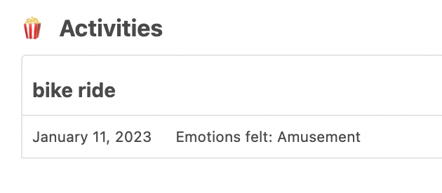
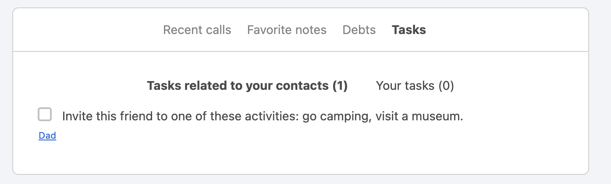
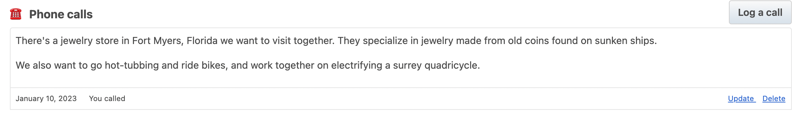
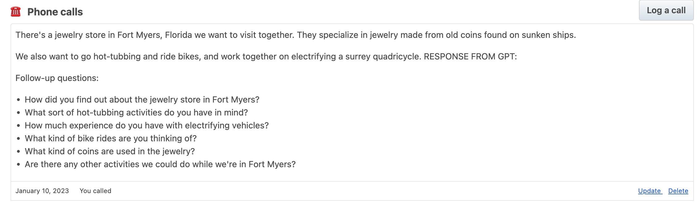
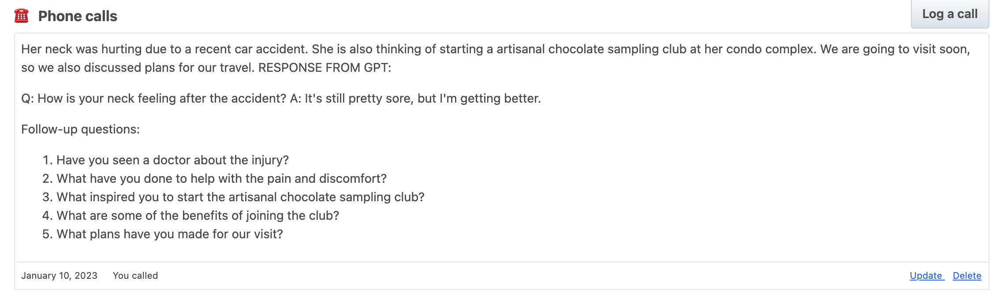

[Monica](https://github.com/monicahq/monica) is a really neat tool that allows you to manage your personal relationships better by logging calls, birthdays, activities, and other imformation.

This script adds OpenAI suggestions to your Monica UI to help you ask good questions, suggest fun activities, and deepen your relationships even further.

Activities
====
Add an activity:

The script asks OpenAI for similiar activities, and then adds them as a task for you:

Calls
====

Add a call:

This script runs the call log content against OpenAI, asking for suggestions and follow-up questions, and then updates the call with the response:

Other examples

Setup
====

configue the `.env` file with your API keys

Run
====

`python3 main.py`

todo: check if there's an on-save hook for calls and run this automatically