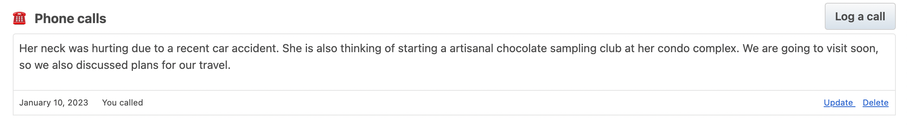

Adds OpenAI suggestions to your [Monica PRM](https://github.com/monicahq/monica)

Add a call:

This script runs the content against OpenAI, asking for suggestions, and then updates the call with the response:

