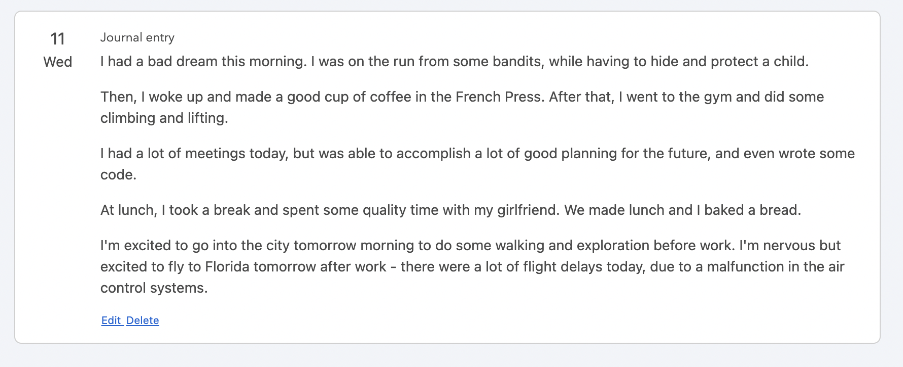
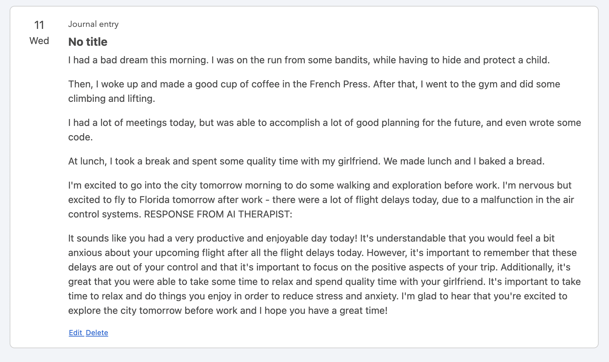

[Monica](https://github.com/monicahq/monica) is a really neat tool that allows you to manage your personal relationships better by logging calls, birthdays, activities, and other information.

This script adds OpenAI suggestions to your Monica UI to help you ask good questions, suggest fun activities, and deepen your relationships even further. It also acts as an AI therapist on your Journal entries.

Journal Entries
====

Add a journal entry:

The script has AI act as your therapist and gives you advice and suggestions:

Activities
====
Add an activity:

The script asks OpenAI for similiar activities, and then adds them as a task for you:

Calls
====

Add a call:

This script runs the call log content against OpenAI, asking for suggestions and follow-up questions, and then updates the call with the response:

Other examples

Easy mode: run it automatically with Github Actions
====

1) Set [up MonicaGPT](https://www.monicahq.com/) 
1) Fork this repo
1) Click the Actions tab, and enable Actions workflows to run
1) Click Settings, and add `MONICA_ACCESS_TOKEN` and `OPENAI_ACCESS_TOKEN` as secrets, with your API token values from those two sites
1) The Github Action defined in `.github/workflows/run.yml` will run it as often as Github allows (which is around every 5 minutes, but out of my control)

Alternatively: run it manually 
====

1) configue the `.env` file with your API keys
1) `pip install -r requirements.txt`
1) `python3 main.py`

TODO
====

1) check if there's an on-save hook for calls and run this automatically
1) set it up on AWS and write a guide for that